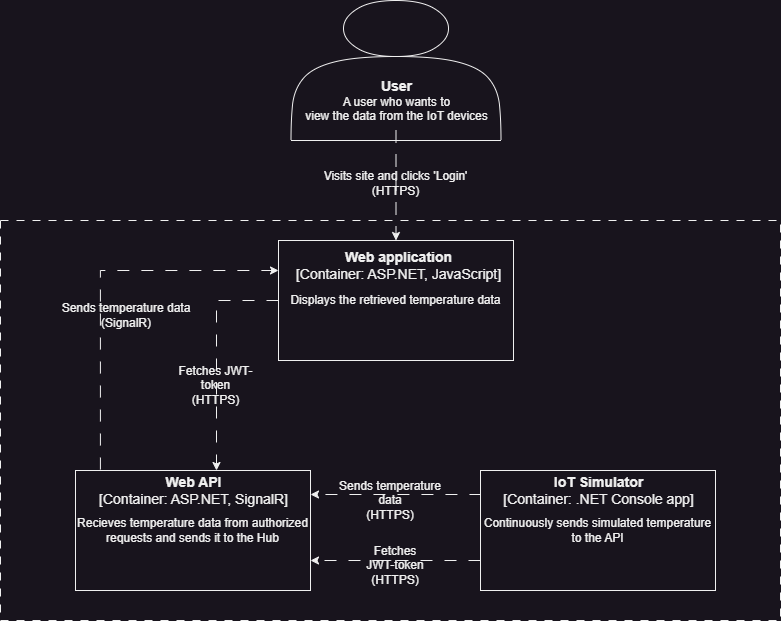

# Datakommunikation och säkerhet
Repo för inlämningar i kursen Datakommunikation och Säkerhet.
Här ligger alla mina inlämningar uppdelade i varsin folder

# Rapport för Inlämning 4

### *Kort beskrivning*
Lösningen består utav 3 olika projekt, löst beskrivet skickas data från IoTTempSimulator till servern (ett WebApi) som i sin tur skickar denna data till en hub som webbklienten ansluter till. I webbklienten tas datat kontinuerligt emot och visas på hemsidan.

### *Ingående beskrivning om vardera projekt*

### IoTTempSimulator

**Startup**\
Ett Console App projekt, i dethär projektet skapas 3st olika instanser av klassen IoTSimulator. De får olika värden för min/max temperatur samat min/max luftfuktighet för att göra det hela lite intressantare. De får även varsitt ID för att kunna skilja på vem som skickar vad, 
i konstruktorn anges också identitetsnamnet som är det som kommer att bli simulatorns "roll" i APIet och är det som avgör huruvida simulatorn kommer att bli 1. Auktoriserad och 2. Autentiserad att skicka data till APIets 'SendTemperatureDataAsync' endpoint.\
Simulatorerna 'simulator1' och 'simulator2' får identiteten 'sensor' som är den roll som är autentiserad att kunna skicka data till APIets endpoint. 'simulator3' får identiteten 'user' och kommer att lyckas bli auktoriserad, men dens anrop kommer att bli nekade av APIet då den rollen inte är autentiserad att skicka data till endpointen. Detta är för att påvisa att APIet skiljer mellan olika roller.

När instanserna är uppsatta sätts en lista av tasks upp för vardera simulator där de sedan kommer att starta samtidigt och köras parallelt.

**Process**\
Simulatorn startar och försöker att få en JWT-token från APIet genom att skicka en request till ett Login-endpoint med sin satta identitet. Simulatorn avbryts ifall detta misslyckas.\
Sedan startar en loop som kontinuerligt skickar slumpad väderdata till APIet, datat krypteras först med hjälp av Aes där Aes IV och Key hämtas från en hårdkodad Base64String i config.json. 
Efter kryptering serialiseras datat och skickas med ett HTTPS-POST anrop till APIet, i anropet läggs den hämtade JWT-tokenen till som Auktoriserings (Bearer) värde

### WebApi

**Startup**\
Servern/WebApiet är uppsatt med en CorsPolicy för att bara tillåta GET-anrop från webbklienten. APIet har JWT som autentisering som kräver säker anslutning (HTTPS) och validerar parametrarna Issuer, Audience och Lifetime på en token.
Signaturen av tokenets utfärdare valideras även med 'SecretKey' som är satt i appsettings.
APIet har också två policies, en 'WritePermission' som kräver rollen 'sensor' samt en 'ReadPermission' som kräver rollen 'user'.

**Process**\
*Auktorisering:* APIet har en endpoint (/Login) för auktorisering som tar emot en LoginRequest som bara innehåller en string 'Name' för enkelhetens skull. När endpointen anropas valideras requesten och hämtar sedan en token ifrån Login-metoden i AuthService-klassen. Här finns en hårdkodad lista av typen IdentityRole som innehåller två roller: 'sensor' samt 'user'. Login metoden kollar ifall rollen finns i listan och returnerar isåfall en JWT-token med hjälp av JwtService-klassen som innehåller rollen. I annat fall returneras 'Unauthorized'.\
\
*Temperaturdata:*
APIet har en endpoint för att ta emot temperaturdata, metoden kräver auktorisering och autentiserar att anropet är autentiserat med policyn 'WritePermission'. Datat som inkommer dekrypteras med hjälp av Aes för att sedan deserialiseras till en instans av TemperatureDataRequest som valideras. Vid godkänd validering skickas requesten till alla Hub-klienter.\
Anslutningar till hubben kräver även auktorisering och autentiserar att anslutningen är autentiserat med policyn 'ReadPermission'.

### WebClient

**Startup**\
Webbklienten använder CSP för att begränsa källor för webbinnehåll, CSPn tillåter endast anslutning i form av HTTPS och WSS från APIet. Resterande CSP-värden är satta till 'self'.

**Process**\
En SignalR-anslutning byggs upp till serverns '/temperatureHub' där en token som hämtas från localstorage sätts som Access Token för att auktorisera och autentisera anslutningen. Anslutningen försöker starta på en gång, lyckas den inte försöker den på nytt igen var 5e sekund.\
Webbsidan har två knappar, 'Login' och 'Logout'. Vid login kommer en request skickas med identiet 'user' till APIets login endpoint som sätter den returnerade JWT-token till localstorage. Logout tar helt enkelt bort tokenen från localstorage och stänger anslutningen.\
När anslutningen är igång kommer datat som kontinuerligt tas emot från hubben att valideras och presenteras på hemsidan, varje simulator får en egen ruta där man även kan se en logg med alla tidigare skickade data.

### C4-Diagram

